# Project Set up 

##  Important Considerations: 
* Ensure you are using Azure subscription where you have access to create/edit/delete resources.
* Prefer using the East US, East US2, and Sweden Central regions (where all services/models are available). Availability changes very frquently so make sure to check models and AI services availability 
[Model summary table and region availability](https://learn.microsoft.com/en-us/azure/ai-services/openai/concepts/models?tabs=global-standard%2Cstandard-chat-completions#model-summary-table-and-region-availability)
* Ensure you have sufficient quota available for model deployments(in case you need to use regional deployments).
* Private networks - out of scope
* This set up uses Managed Identities which is recommended authentication option. If you dont want to set up connections using Managed Identities, you dont have to follow steps to change connections to Entra ID and roles and permissions specificed below. By default connections will use keys and secrets will be stored in the keyvault. 

 AI Foundry Resources 

&nbsp;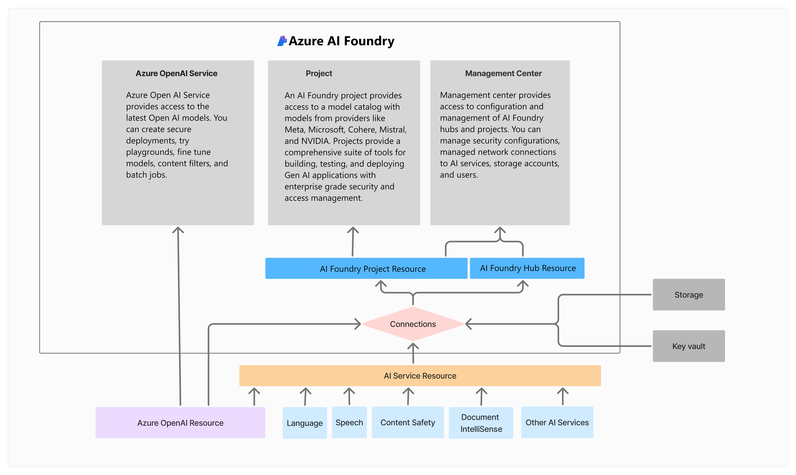

##  Step-by-Step Guide 
0. Download and unzip *benefits.zip* file from data folder to your local machine. 
1. **Create Hub**
    - Create a new resource group. Create a separate resource group for this exercise. 
    
        *Eg: aiworkshop-rg*

    - Create AI Foundry hub 

        - You can create Hub either from Azure portal or from AI Foundry link directly: https://ai.azure.com/
        - Go to Azue portal and search Azure AI Foundry. Click on Create Hub option 

            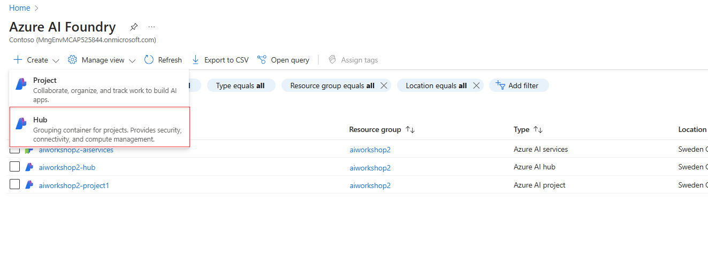

        - Use naming convention as shown below - 
        
          *Eg: aiworkshop-contosohub*
        
            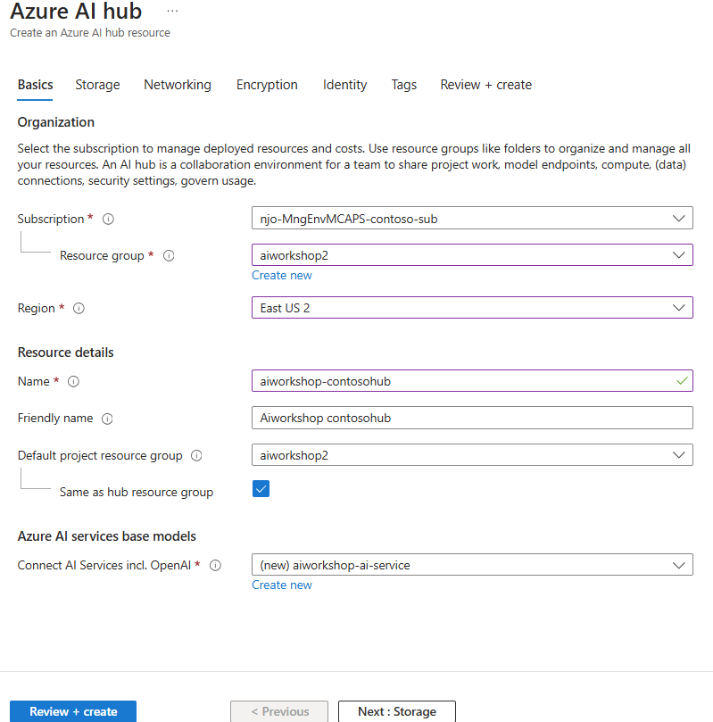

        For Open AI/AI Service use naming convention eg: *aiworkshop-ai-service*
        Use similar naming convention for other resources *Eg: aiworkshopstorage, aiworkshop-keyvault etc.*

        Please select **managed identity/Entra ID** option for connectivity to storage account. 
        
        
        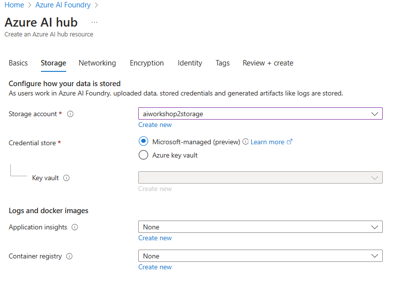

2. **Create Project**
    - Initiate a new project within the created hub.    *Eg: aiworkshop-contosobuddy-project*

        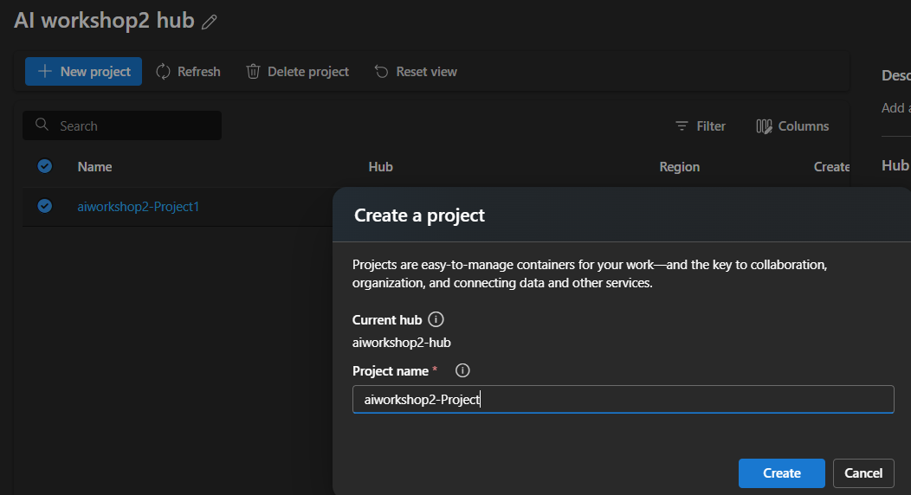

    - Go to the default storage account created and create new container *"data"* 

    - Upload all benefits files from downloaded folder to this container.    

        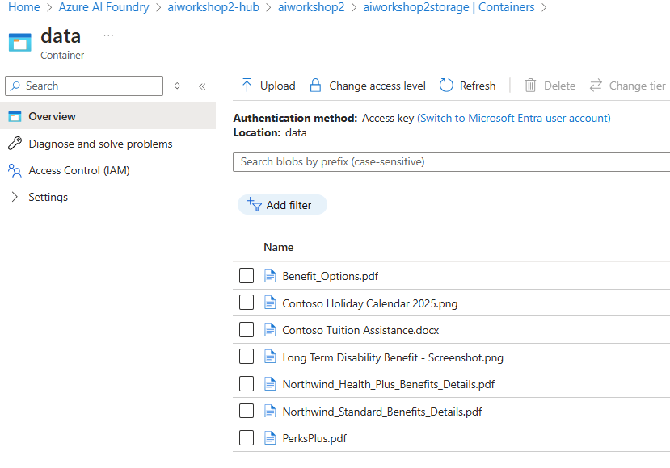

3. **Create Azure AI Search resource in the same resource group**
    You can create this from Azure portal and going to Azure AI Search or you can go to Connected resources under Management center in AI Foundry and click on new connection to add and create Auzre AI Search resource. 

    - Set up AI Search and AI Service within this resource group. *Eg: aiworkshop-ai-search*

    *Make sure your AI search resource is either Basic or Standard tier. Free comes with limited indexes and features.*

3. **Open Management Center**
    - Access the management center for further configurations.

4. **Add User as Azure AI Developer**
    - Navigate to the users section.
    - Add your user as an Azure AI Developer.

      *Note: this role may not require if you are already owner*

5. **Configure Connected Resources**
    - Go to Connected Resources.
    - For each connected resource, edit the access details.
    - Change the authentication method to use Microsoft Entra ID.    
    - Update the access details.

    **Note:** *This set up uses managed identities which is recommended authentication. If you dont want to set up connections using Managed Identities, you dont have to change connections to use Entra ID and keep using keys by default.*

6. **Configure Search and AI Services**
    - Go to Search Services and AI Services on the portal.
    - Ensure you are using the same resource as in the connected resources.
    - Under Settings and Identity, enable it and save the changes.
7. **Set Up API Access Control**
    - Go to Search Services.
    - Under Settings and Keys, set up API access control and choose both.

        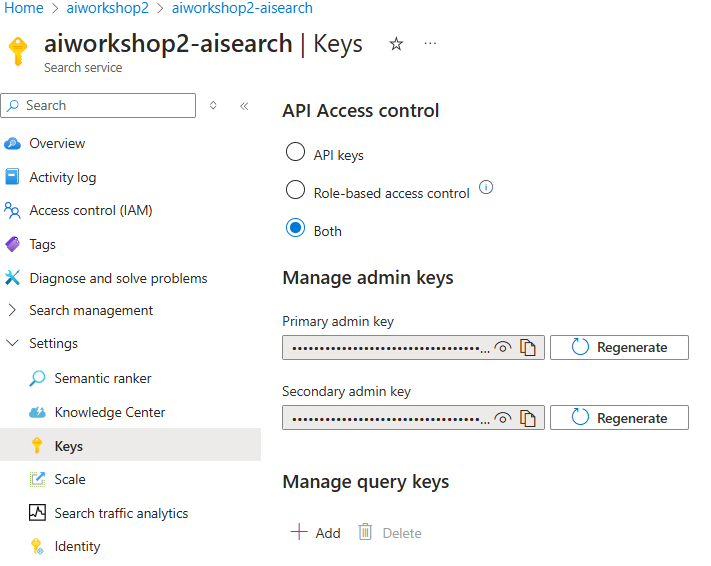
    
8. **Assign Roles in Search Service**
    - Still under Search Service, go to Access Control (IAM).
    - Add the following roles:

    | Resource | Role | Assignee |
    | --- | --- | --- |
    | Azure AI Search | Search Index Data Contributor | Azure AI services/OpenAI |
    | Azure AI Search | Search Service Contributor | Azure AI services/OpenAI |
    | Azure AI Search | Search Index Data Contributor | User |
    | Azure AI Search | Search Service Contributor | User |

    Refer below screenshots: 

    Permissions to Azure AI service: 
    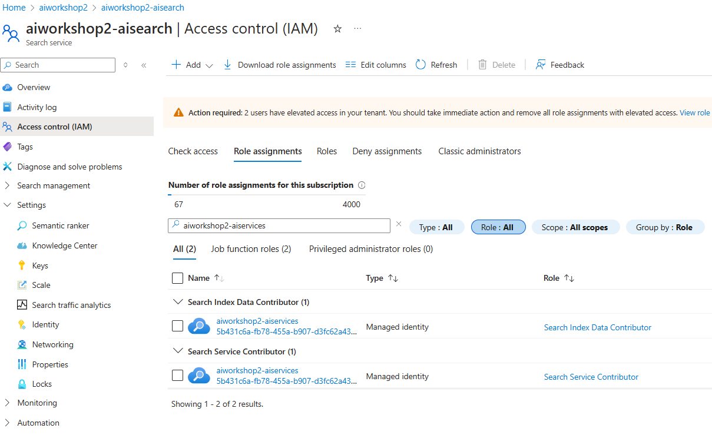

    Permissions to user: 

    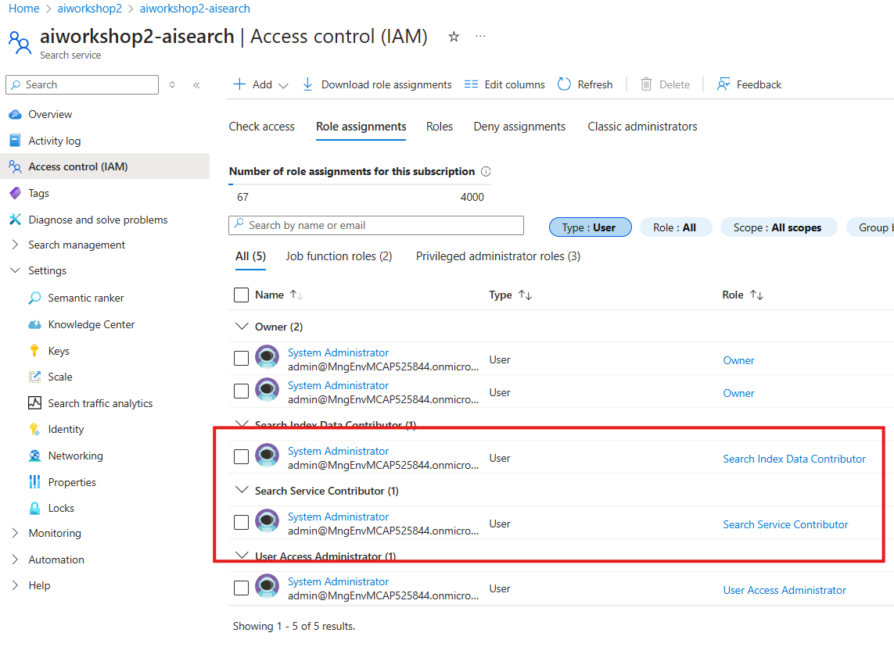

9. **Assign Roles in Azure AI Services**
    - Go to Azure AI services within your resource group.
    - Add the following roles:

    | Resource | Role | Assignee |
    | --- | --- | --- |
    | Azure AI services/OpenAI | Cognitive Services Contributor | Azure AI Search |
    | Azure AI services/OpenAI | Cognitive Services OpenAI Contributor | Azure AI Search |
    | Azure AI services/OpenAI | Cognitive Service Contributor | User |
    | Azure AI services/OpenAI | Cognitive Service OpenAI Contributor | User |

    Refer below screenshots: 

    Permissions to Azure AI search resource: 

    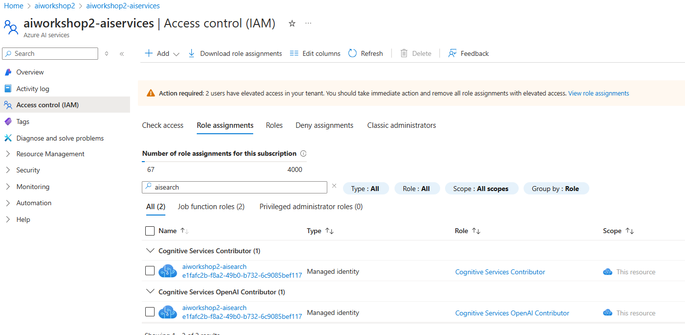

    Permissions to user: 

    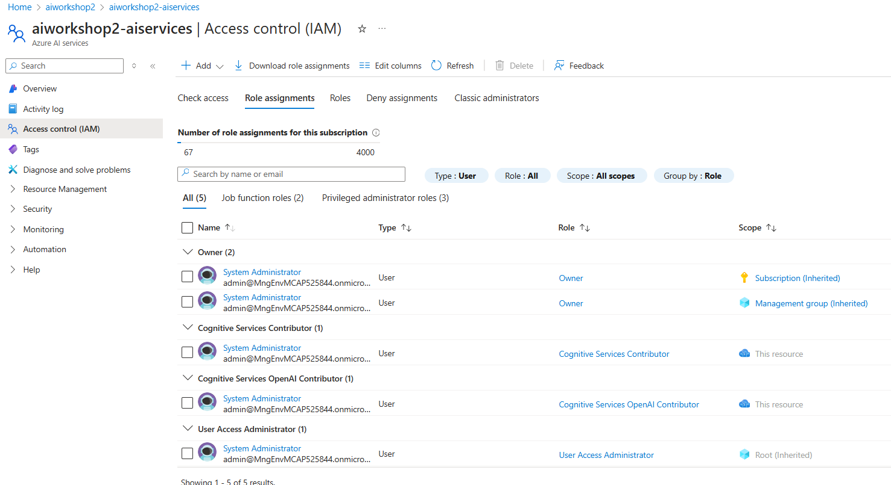

10. **Configure Storage Account**
    - Go to the Storage Account under your resource group.
    - Under Settings and Configurations, enable Microsoft Entra authorization in the Azure portal and save it.
    - Go to Access Control and add these roles:

    | Resource | Role | Assignee |
    | --- | --- | --- |
    | Azure Storage Account | Storage Blob Data Reader | Azure AI Search |
    | Azure Storage Account | Storage Blob Data Contributor | Azure AI services/OpenAI |
    | Azure Storage Account | Storage Blob Data Contributor | User |
    | Azure Storage Account | Storage Blob Data Reader* | User |

    **Note:**
    - *For auto evaluation step under section 1.4 will require Storage blob data reader role even though Contributor role is present. This may change in future!*
    - *When using Identity based authentication, you need to add "Storage File Data Contributor" role to the user as well to access some of the services like prompt flow which stores files in storage account.* 

    Please see below screenshots for reference: 
    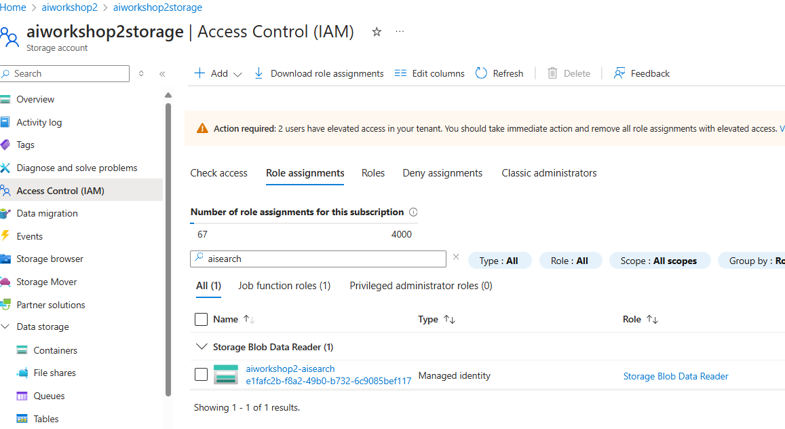

    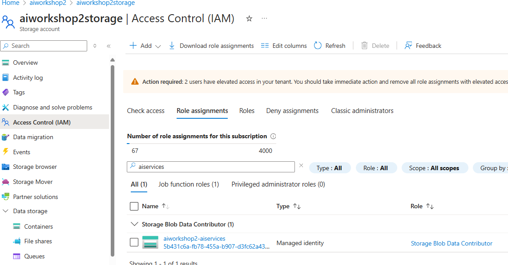

    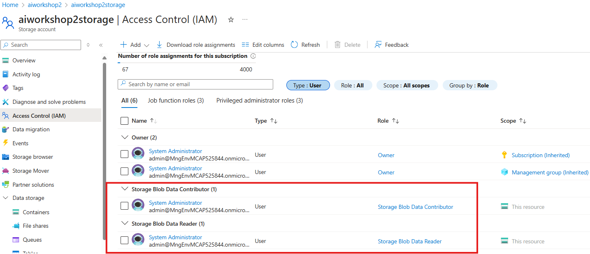

11. **Create Deployment**
    - Create model deployments in your AI foundry project: 
    - GPT 4o    
    - text-embedding-ada-002
    *(or other latest models supported in the region you have selected)*

**Resources outside of AI Foundry:**

12. Make sure you have connections set up with Entra ID authentication as shown in below screenshot:

    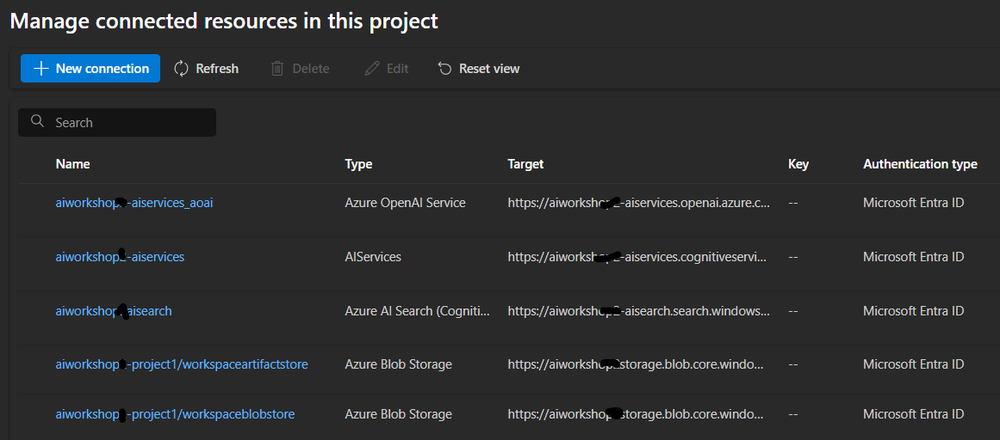

Please note - in case due to any reason, if you have more than one connection here for the services - make sure you are using right connections during Add your data option and other steps in this workshop. 

Below resources are required for Integrated Vectorization to work. (*Current limitation, but will be fixed very soon by Azure AI search team*)

13. **Azure Open AI resource**

Goto Azure Open AI service and create new Azure Open AI service under same resource group. 

*Eg: aiworkshop-aoai-service*

14. **AI Multi service account**

Create new AI multi service account under same resource group. 
*Eg: aiworkshop-ai-multiservice*

###  References: 
https://learn.microsoft.com/en-us/azure/ai-studio/tutorials/deploy-chat-web-app
https://learn.microsoft.com/en-us/azure/ai-services/openai/how-to/on-your-data-configuration#role-assignments 

