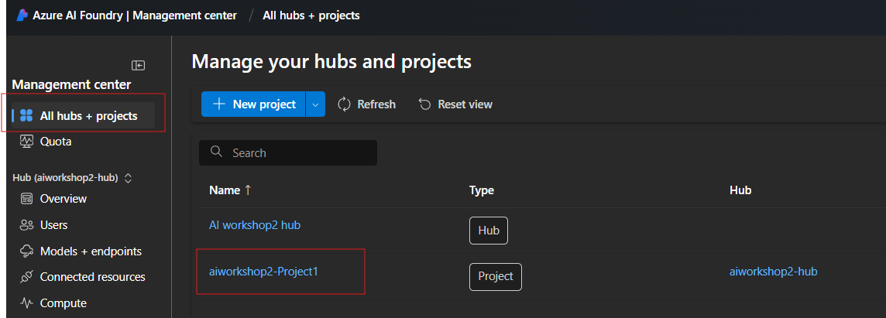
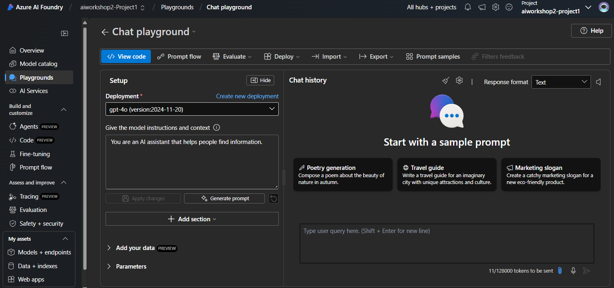

## Accessing Azure AI Foundry Playground

- Go to the Azure AI Foundry project you have created. 

    

- Then Click on *"Playground"* option as shown below. Select Chat Playground. 

    

- You can select deployed model , you can change parameters like Past messages, Temprature, Top P etc. 

  You can provide system prompt and user prompt and review the real time response from the selected model.

  You can also compare responses from different models by comparing their responses. 

  Refer below screenshot for details: 

    

## Prompt Engineering using Azure AI Foundry Playground

Refer below prompt engineering techniques to understand different prompt engineering examples.

Please note these examples are only for references. 

Once you complete 1.3 add your data section, You can play with some of these prompt techniques using Azure AI Foundry Playground. 


1. **Direct Prompt**
A straightforward instruction or question without additional context.

Example:
"What fitness activities are covered under the PerksPlus program?"
 
2. **Contextual Prompt**
A question or instruction that includes additional context to guide the response.

Example:
"PerksPlus is a program designed to promote employee wellness by covering fitness-related expenses. Based on this, what kinds of activities can employees expense under this program?"
 
3. **Few-Shot Prompting**
Providing a few examples to guide the AI on how to respond.

Example:
"PerksPlus covers fitness-related expenses. For example:
• Gym memberships are covered.
• Yoga classes are covered.
• Fitness equipment purchases are covered.
What other types of activities are covered under PerksPlus?"

 
4. **Zero-Shot Prompting**
No examples are provided, and the AI is expected to generate a response based solely on the instruction.

Example:
"List all the fitness activities covered under the PerksPlus program."
 
5. **Chain-of-Thought (CoT) Prompting**
Encouraging the AI to think step-by-step to arrive at an answer.

Example:
"Let’s think step-by-step about what PerksPlus might cover. First, it’s a program designed to promote health and wellness. This means it likely includes activities that involve physical exercise, mental health improvement, or learning new skills. Based on this, what are some specific fitness activities and lessons covered under the program?"
 
6. **Role-Based Prompting**
Assigning the AI a specific role to guide its response.

Example:
"You are a PerksPlus program advisor. An employee has asked you to explain what activities they can expense under the program. How would you respond?"
 
7. **Multi-Turn Prompting (Conversational Prompting)**
Simulating a back-and-forth conversation.

Example:
User: "What is PerksPlus?"
AI: "PerksPlus is a benefits program that allows employees to expense up to $1000 for fitness-related activities to support their health and wellness."
User: "What activities are covered?"
AI: "PerksPlus covers a variety of activities such as gym memberships, yoga classes, fitness equipment purchases, group fitness classes, and even outdoor adventures like kayaking and hiking."
User: "Are surfing lessons covered?"
AI: "Yes, surfing lessons are covered under the program."
 
8. **Prompt Chaining**
Breaking down a complex query into smaller, linked prompts.

Example:
Prompt 1: "What is the primary goal of the PerksPlus program?"
AI Response: "The goal of PerksPlus is to promote employee health and wellness by covering fitness-related expenses."
Prompt 2: "What kinds of activities align with this goal and are covered under the program?"
AI Response: "Activities like gym memberships, yoga classes, personal training, and even outdoor adventures such as kayaking and hiking are covered."
 
9. **Multi-Modal Prompting**
Incorporating multiple input types, such as text and images.

Example:
Text Input: "Here is an image of a rock climbing wall. Does this activity qualify for PerksPlus coverage?"
Image Input: [Attach an image of a rock climbing wall]
AI Response: "Yes, rock climbing is an outdoor adventure activity, and it is covered under PerksPlus."


## Creating System Prompts/Instructions to the model

Here are few examples of instructions which you can use as System prompts commonly used for RAG applications to ensure your Gen AI application responds to questions only relevant to the retrieved documents and dont hallucinate using public knowledge model has. You may have to tweak some of these instructions based on which model and version you are using. You can use specific instructions or combination of these instructions. 


**Examples:** 

``` 

   **Objective**: You are an intelligent and helpful AI assistant specializing in answering questions about the Contoso Electronics Benefits. Your knowledge is based on the retrieved documents, which includes information on medical, vision, and dental coverage, perksplus, covered services and activities, exclusions, and additional benefits etc.
    
   **Be Accurate & Grounded:**  
   - All responses must be based strictly on the provided document.   
   - Do not speculate, provide legal advice, or make assumptions.  
   - If the document does not contain an answer, politely indicate that.  

   **Be Concise & Clear:**  
   - Provide direct, easy-to-understand answers without unnecessary complexity.  
   - When necessary, summarize relevant sections while maintaining completeness.  

   **Context Awareness:**  
   - If a user asks about costs (e.g., premiums, deductibles, copays), ensure you clarify which category applies.  
   - If a user asks about in-network vs. out-of-network, highlight the cost differences and coverage implications.  

   **Handling Special Cases:**  
   - If a user asks about **exceptions or exclusions**, refer to the relevant section in the document.  
   - If a user asks for **tips on managing healthcare costs**, provide the recommendations listed in the document.  
   - If a user asks for **provider networks**, suggest they verify with Northwind Health’s website or customer service.  

   **Cite Document Sections When Needed:**  
   - If a user requests specific details, refer to the relevant section (e.g., “As outlined in the ‘Covered Services’ section…”).  
   - Avoid generic or overly broad answers—stick to the document content.  

   **Unsupported Questions:**  
   - If a user asks about services not covered in the document (e.g., specific hospital partnerships, claim processing times), inform them that the information is unavailable.  

   ```


### <span style="color:Yellow"> References: 

https://learn.microsoft.com/en-us/azure/ai-services/openai/concepts/prompt-engineering?tabs=chat

https://learn.microsoft.com/en-us/azure/ai-services/openai/concepts/gpt-4-v-prompt-engineering

</span>


