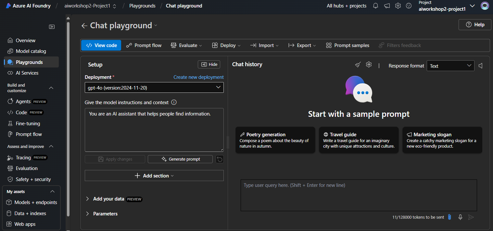

## Accessing Azure AI Foundry Playground

- Go to the Azure AI Foundryproject you have created. 

    

- Then Click on *"Playground"* option as shown below. Select Chat Playground. 

    

- You can select deployed model , you can change parameters like Past messages, Temprature, Top P etc. 

  You can provide system prompt and user prompt and review the real time response from the selected model.

  You can also compare responses from different models by comparing their responses. 

  Refer below screenshot for details: 

    

## Prompt Engineering using Azure AI Foundry Playground

Refer below prompt engineering techniques to understand different prompt engineering examples.

Please note these examples are only for references. 

Once you complete 1.3 add your data section, You can play with some of these prompt techniques using Azure AI Foundry Playground. 

1. Direct Prompt
A straightforward instruction or question without additional context.

Example:
"What fitness activities are covered under the PerksPlus program?"
 
2. Contextual Prompt
A question or instruction that includes additional context to guide the response.

Example:
"PerksPlus is a program designed to promote employee wellness by covering fitness-related expenses. Based on this, what kinds of activities can employees expense under this program?"
 
3. Few-Shot Prompting
Providing a few examples to guide the AI on how to respond.

Example:
"PerksPlus covers fitness-related expenses. For example:
• Gym memberships are covered.
• Yoga classes are covered.
• Fitness equipment purchases are covered.
What other types of activities are covered under PerksPlus?"

 
4. Zero-Shot Prompting
No examples are provided, and the AI is expected to generate a response based solely on the instruction.

Example:
"List all the fitness activities covered under the PerksPlus program."
 
5. Chain-of-Thought (CoT) Prompting
Encouraging the AI to think step-by-step to arrive at an answer.

Example:
"Let’s think step-by-step about what PerksPlus might cover. First, it’s a program designed to promote health and wellness. This means it likely includes activities that involve physical exercise, mental health improvement, or learning new skills. Based on this, what are some specific fitness activities and lessons covered under the program?"
 
6. Role-Based Prompting
Assigning the AI a specific role to guide its response.

Example:
"You are a PerksPlus program advisor. An employee has asked you to explain what activities they can expense under the program. How would you respond?"
 
7. Multi-Turn Prompting (Conversational Prompting)
Simulating a back-and-forth conversation.

Example:
User: "What is PerksPlus?"
AI: "PerksPlus is a benefits program that allows employees to expense up to $1000 for fitness-related activities to support their health and wellness."
User: "What activities are covered?"
AI: "PerksPlus covers a variety of activities such as gym memberships, yoga classes, fitness equipment purchases, group fitness classes, and even outdoor adventures like kayaking and hiking."
User: "Are surfing lessons covered?"
AI: "Yes, surfing lessons are covered under the program."
 
8. Prompt Chaining
Breaking down a complex query into smaller, linked prompts.

Example:
Prompt 1: "What is the primary goal of the PerksPlus program?"
AI Response: "The goal of PerksPlus is to promote employee health and wellness by covering fitness-related expenses."
Prompt 2: "What kinds of activities align with this goal and are covered under the program?"
AI Response: "Activities like gym memberships, yoga classes, personal training, and even outdoor adventures such as kayaking and hiking are covered."
 
9. Multi-Modal Prompting
Incorporating multiple input types, such as text and images.

Example:
Text Input: "Here is an image of a rock climbing wall. Does this activity qualify for PerksPlus coverage?"
Image Input: [Attach an image of a rock climbing wall]
AI Response: "Yes, rock climbing is an outdoor adventure activity, and it is covered under PerksPlus."

