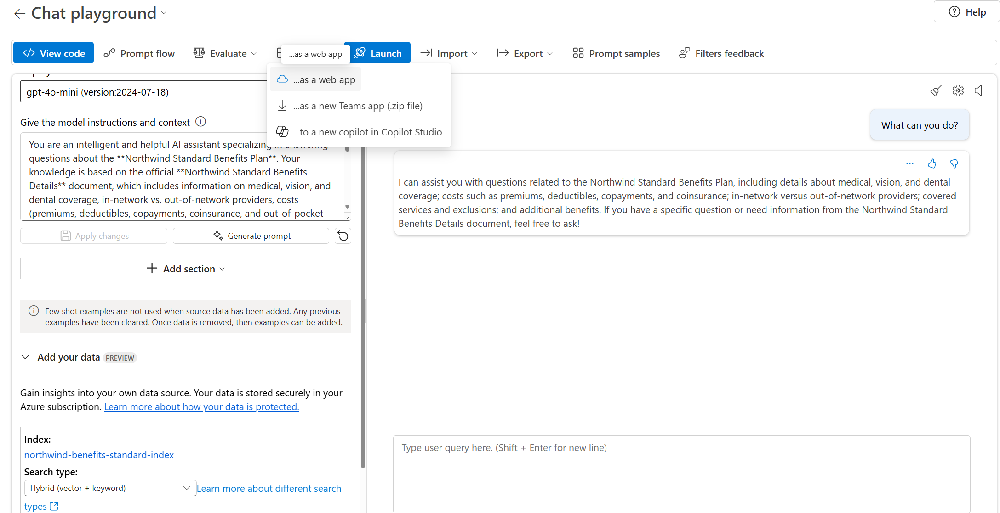
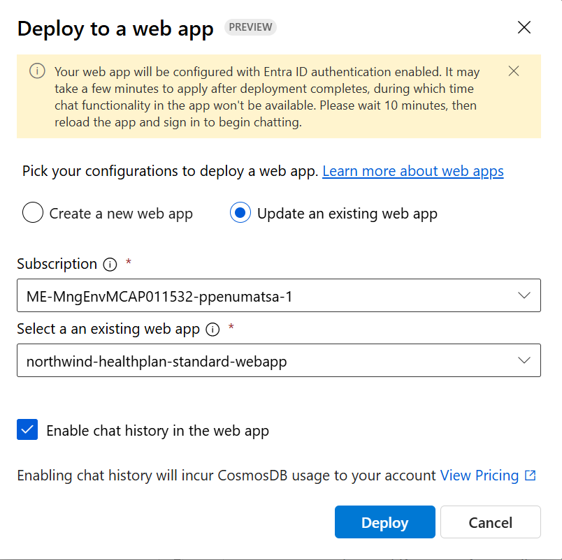

## Deploy the web app

Publishing creates an Azure App Service in your subscription. It might incur costs depending on the pricing plan you select. When you're done with your app, you can delete it from the Azure portal.

To deploy the web app:

> **Important**
> 
> You need to register Microsoft.Web as a resource provider before you can deploy to a web app.

1. Complete the steps in the previous section to add your data to the playground.

2. Select **Deploy > ...as a web app**.

   Screenshot of the deploy new web app button.
   
   **Deploy > ...as a web app**.

3. On the **Deploy to a web app** page, enter the following details:

   - **Name**: A unique name for your web app.
   - **Subscription**: Your Azure subscription. If you don't see any available subscriptions, first register Microsoft.Web as a resource provider.
   - **Resource group**: Select a resource group in which to deploy the web app. Use the same resource group as the hub.
   - **Location**: Select a location in which to deploy the web app. Use the same location as the hub.
   - **Pricing plan**: Choose a pricing plan for the web app.
   - **Enable chat history in the web app**: For the tutorial, the chat history box isn't selected. If you enable the feature, your users have access to their individual previous queries and responses. For more information, see chat history remarks.

4. Select **Deploy**.

5. Wait for the app to be deployed, which might take a few minutes.

6. When it's ready, the **Launch** button is enabled on the toolbar. But don't launch the app yet and don't close the chat playground page - you'll return to it later.

## Updating the Web App

To update the web app with chat history enabled:

1. Use the playground to add more data or test the model with different scenarios.
2. When ready, select **Deploy > ...as a web app** again.
3. Choose **Update an existing web app** and select the existing web app from the list.
4. select **Enable chat history in the web app** 
4. The existing web app will be deployed with chat history.

